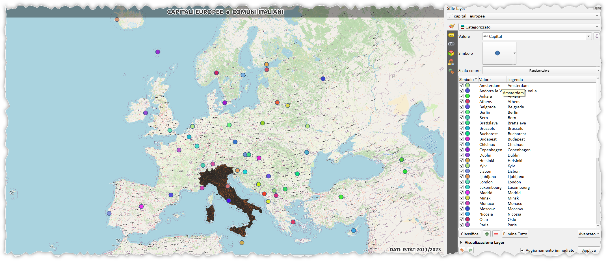

# cityEuropee_piu_vicine

Creare una mappa delle capitali europee più vicine ai comuni italiani usando QGIS.

------------- IN COSTRUZIONE ---------- 

<!-- TOC -->

- [cityEuropee\_piu\_vicine](#cityeuropee_piu_vicine)
- [INTRO](#intro)
- [FLOWCHART](#flowchart)
  - [tematizzare i punti usando l'attributo Capital](#tematizzare-i-punti-usando-lattributo-capital)
  - [poligoni di voronoi](#poligoni-di-voronoi)
  - [tematizzare i poligoni di voronoi con lo stesso tema](#tematizzare-i-poligoni-di-voronoi-con-lo-stesso-tema)
    - [espressione utilizzata](#espressione-utilizzata)
  - [assegnare comune](#assegnare-comune)
  - [Campi virtuali](#campi-virtuali)
  - [demo](#demo)
- [RIFERIMENTI](#riferimenti)
- [DISCLAIMER](#disclaimer)

<!-- /TOC -->

# INTRO

Creare una mappa delle capitali europee più vicine ai comuni italiani usando QGIS e tematizzando i comuni in funzione del tema del punto che caratterizza la capitale europea.


# FLOWCHART

## tematizzare i punti usando l'attributo Capital



## poligoni di voronoi


## tematizzare i poligoni di voronoi con lo stesso tema


### espressione utilizzata

```
overlay_contains('capitali_europee',get_symbol_colors())[0]
```


**NB:** la funzione `get_symbol_colors()` viene installata in QGIS dopo aver installato il plugin DataPloty, lo ritroveremo nel field calc sotto il gruppo `DataPloty`.

## assegnare comune

I poligoni di voronoi intersecano alcuni comuni lungo i perimetri di delimitazione, a chi assegnare il comune?


Potremmo usare vari criteri:
1. dove ricade il centroide del comune rispetto al poligono di voronoi;
2. punto che individuo il municipio;
3. confine condiviso pù lungo;
4. porzione di superficie maggiore;
5. tagliare il comune e assegnare il colore in funzione a dove ricade;
6. ecc...

per facilità, lascio decidere a QGIS usando la seguente espressione (con predicato _intersects_):

```
overlay_intersects(
layer:='voronoi',
expression:= "colore" )[0]
```

ricordo che l'attributo `colore` del layer `voronoi` è un campo virtuale popolato con l'espressione `overlay_contains('capitali_europee',get_symbol_colors())[0]`:


## Campi virtuali

Avendo utilizzato i campi virtuali ora sarà semplice ed immediato cambiare il tema ai punti e di conseguenza cambieranno i colori dei comuni. È una operazione un po' pesante e dipende molto dalle risorse del PC. (PURTROPPO CAMBIANDO I TEMI DEI PUNTI QGIS CRASHA, QUI [ISSUE](https://github.com/ghtmtt/DataPlotly/issues/335))

Per ovviare al problema (nell'attesa che risolvano il bug) utilizzare la seguente funzione personalizzata (realizzata dall'amico G. Fattori):

```py
from qgis.core import *
from qgis.gui import *
from qgis.utils import iface

@qgsfunction(args='auto',  group='Custom')
def get_cat_param( vlayer, cat_field, param, feature, parent):
    """
    Dato un layer <b>categorizzato con riempimento semplice</b> restituisce i parametri di impostazione
    <ol>
        <li>parametro: <b>layer</b></li>
        <li>parametro: <b>campo categorizzazione </b></li>
        <li>parametro scelto tra:</li>
            <ul>
                <li><b>'color'</b> &nbsp; colore riempimento</li>
                <li><b>'style'</b> &nbsp; stile riempimento</li>
                <li><b>'outline_color'</b> &nbsp; colore tratto</li>
                <li><b>'outline_width'</b> &nbsp; spessore tratto</li>
                <li><b>'outline_style'</b> &nbsp; stile tratto</li>
                <li><b>'joinstyle'</b> &nbsp; stile unione</li>
                <li><b>'offset'</b> &nbsp; spostamento</li>
            </ul>
    </ol>
    <p>Per campi di categorizzazione numerici formattatarli come nell'esempio<p>
    
    <h4>Example usage:</h4>
    <ul>
      <li>get_cat_param('layer', 'campo_cat' ,'color') -> '228,52,199,255'</li>
      <li>get_cat_param('layer', to_string(format_number('"'nomeCampoCategoria'"',2)),'color') -> '228,52,199,255'</li>
    </ul>
    """

    layer = QgsProject.instance().mapLayersByName(vlayer)[0]
    renderer = layer.renderer()
    ret_val = ''
    
    if param not in ('color', 'style', 'outline_color', 'outline_width', 'outline_style', 'joinstyle', 'offset'):
        ret_val = "<strong><font color='red'>NOT VALID PARAM</strong>"
    
    else:
        if layer.renderer().type() == "categorizedSymbol":
            campo = renderer.legendClassificationAttribute()

            for cat in renderer.categories():
                if str(cat_field) == str(cat.value()):
                    ret_val = cat.symbol().symbolLayer(0).properties()[param]
                    break
                else:
                    ret_val = "<strong><font color='red'>Categorized by " + campo + "</strong>"
        else:
            ret_val = "<strong><font color='red'>NOT CATEGORIZED LAYER</strong>"
        
    return ret_val
```

sostituire alla funzione precedentemente utilizzata (`get_symbol_colors()`) la seguente stringa `get_cat_param( 'capitali_europee', "Capital" ,'color')`

in sostanza la funzione da utilizzare è:

```
overlay_contains(
  layer:='capitali_europee', 
  expression:=get_cat_param( 'capitali_europee', "Capital" ,'color'))[0]
```

## demo

[](https://youtu.be/bnAOEsrVgmw "Video")

# RIFERIMENTI

- <https://puntofisso.net/blog/posts/qgis-closest-capital/>
- QGIS: https://www.qgis.org/it/site/


# DISCLAIMER

Il presente contenuto è stato realizzato da _**Salvatore Fiandaca**_ nel mese di agosto 2023 utilizzando [QGIS 3.28 Firenze LTR](https://qgis.org/it/site/) e distribuito con licenza [CC BY 4.0](https://creativecommons.org/licenses/by/4.0/deed.it)